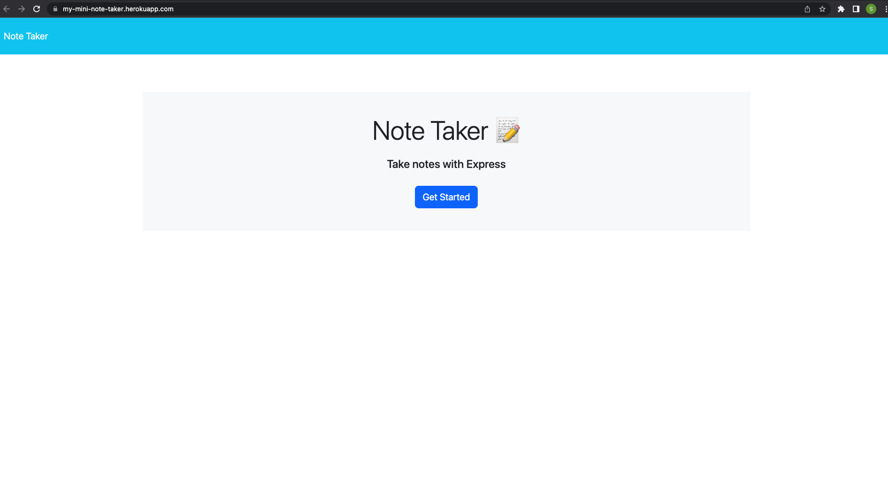
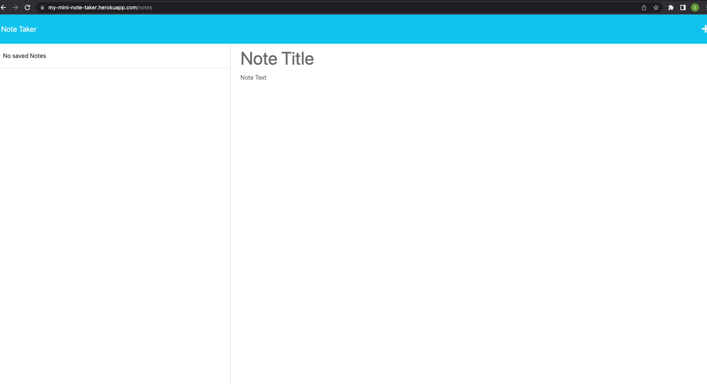
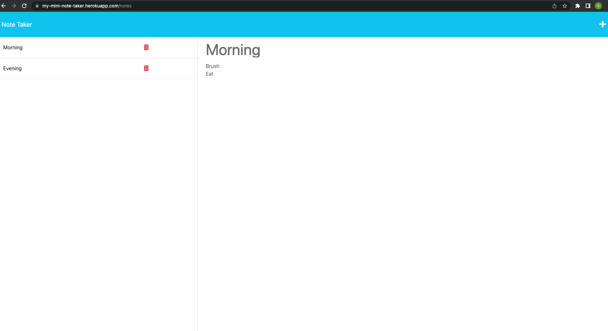

# MY MINI NOTE TAKER

## Table of Contents

* [Description](#description)
* [Usage](#usage)
* [Installation](#installation)
* [License](#license)
* [Screenshot](#screenshot)
* [Deployed](#deployed)
* [Questions](#questions)

## Description 
    
*The what, why, and how:* 
      
My Mini Note Taker is an application that can be used to write and save notes. This application will use an Express.js back end and will save and retrieve note data from a JSON file.

## Usage

* Upon launcing the application the landing page is displayed with a GET START button.
* On clicking the GET START button we will be redirected to the note taking page.
* The existing created notes will be displayed on the left-hand column,plus empty fields to enter a new note title and note's text in the right-hand column.
* On entering a new note and note's text a save icon will appear in the navigation at the top of the page.
* On clicking the save icon the new note I have entered is saved and appears in the left-hand column with the other existing notes.
* On clicking an existing note in the list in the left-hand column then that note appears in the right-hand column.
* On clicking the Write icon in the navigation at the top of the page then we are presented with empty fields to enter a new note title and the note’s text in the right-hand column.
* On clicking the Delete icon next to the existing notes, the note will be deleted.

## Installation

  The application use the `Express` package and use the following command in the project folder: `npm install`.

## License
  
This project is licensed under The MIT License

## Screenshot

## Deployed

The deployed link for this project is 
## https://my-mini-note-taker.herokuapp.com/

## Questions

If you have any questions about this repo, open an issue or contact me directly at sakthiloganathan1127@gmail.com. You can find more of my work at [@sploganathan](https://github.com/sploganathan)

   
---
